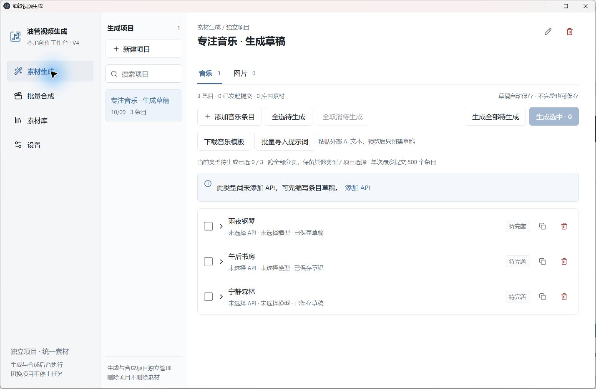
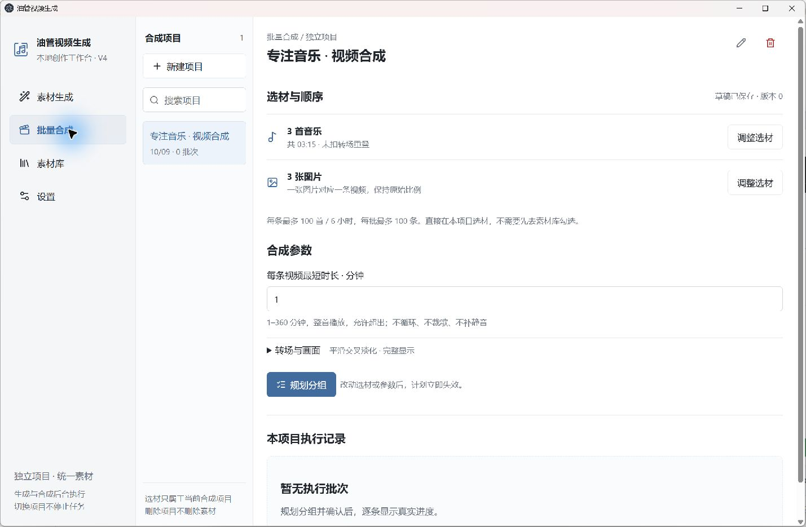
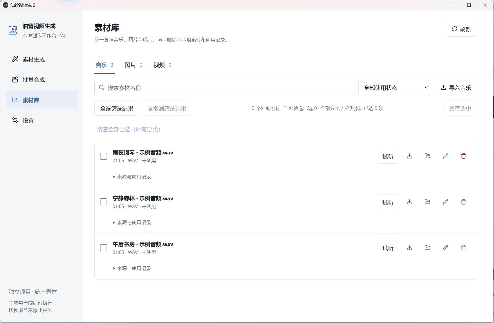
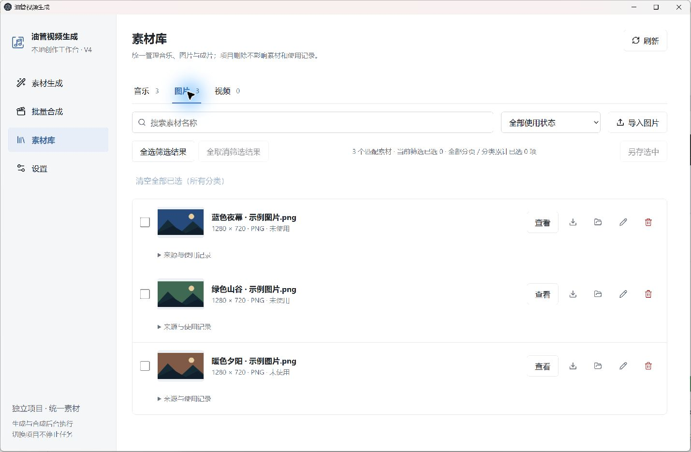

# 油管视频生成 V4.0.4

把音乐和配图制作成适合 YouTube 的长视频。这个 Windows 桌面工作台支持 AI 音乐与图片生成，也可以直接使用本地素材；在独立合成项目中选择音乐、配图和时长，规划分组后输出 MP4。

- **素材生成**：按项目管理音乐与图片草稿，支持批量导入提示词和批量提交。
- **批量合成**：在项目内选材、调整顺序、设置转场；一张图片对应一条视频，音乐整首播放。
- **统一素材库**：集中管理音乐、图片与成片，支持搜索、试听、预览和查看使用记录。

[下载 Windows 便携版](https://github.com/Cherry7593/music-longform/releases/tag/v4.0.4) · [下载与运行](#下载与运行v404) · [源码开发](#从源码开发验证和打包)

## 界面预览

以下为 **2026-10-09 在 Windows 上运行 v4.0.4 源码时拍摄的真实应用窗口**。截图使用独立演示数据：音乐库中的文件为人工测试音频，图片为示意图；未调用 AI 生成服务，也未提交视频合成任务。合成页的 1 分钟是演示设置，实际默认最短时长为 60 分钟。

### 素材生成

每个生成项目独立管理音乐和图片条目。可以先保存提示词草稿，添加适用 API 后再提交；模板下载和批量导入入口就在页面中。



### 批量合成

直接在合成项目内选择音乐和图片，设置最短时长与转场，再规划分组。选材和草稿属于当前项目，执行记录也在同一页面查看。



### 音乐素材库

按名称和使用状态筛选音乐，试听、另存或查看文件位置；每项素材保留来源与使用记录。



### 图片素材库

图片以缩略图展示，并显示尺寸、格式和使用状态。生成结果与本地素材统一管理。



## 版本更新

**4.0.4 更新**：素材生成的音乐与图片请求改为两条独立队列，音乐等待服务端结果时图片照常提交、保存；每条队列内部仍逐个串行，不重复创建请求。界面、数据格式与视频合成不变。见 [4.0.4 变更说明](docs/changes-v4.0.4.md)。

**4.0.3 功能保留**：撤掉生产用 1 秒静态片段生成、缓存和视频轨循环流复制，恢复静态图片连续编码、GOP 300；保留跨合成项目并行、资源预算和 CPU/QSV/NVENC 检测与安全回退。实测与边界见 [4.0.3 变更说明](docs/changes-v4.0.3.md)。

**4.0.2 功能保留**：内置音乐/图片模板下载、批量粘贴解析与预览配置、一次创建 1–500 个待生成草稿；不自动生成、不产生生成费用。见 [4.0.2 说明](docs/changes-v4.0.2.md)。

## 下载与运行（v4.0.4）

从 [v4.0.4 Release](https://github.com/Cherry7593/music-longform/releases/tag/v4.0.4) 下载 [Windows x64 便携版 EXE](https://github.com/Cherry7593/music-longform/releases/download/v4.0.4/music-longform-4.0.4-Windows-x64.exe) 和 [SHA-256 校验文件](https://github.com/Cherry7593/music-longform/releases/download/v4.0.4/music-longform-4.0.4-Windows-x64.exe.sha256)，直接运行，无需安装 Node.js。附件 `music-longform-4.0.4-Windows-x64.exe` 与本地 `dist/油管视频生成-4.0.4-Windows-x64.exe` 字节一致，大小 **106,850,664 bytes**。程序未签名；音频校验与本地视频合成仍需已有 FFmpeg / FFprobe，不自动部署工具、模型或驱动。

**本版在 macOS（Apple Silicon）交叉打包，未在 Windows 实机启动验证**；便携外壳使用 NSIS 3.12（4.0.3 为 3.0.4.1）。如启动异常，请继续使用 [v4.0.3](https://github.com/Cherry7593/music-longform/releases/tag/v4.0.3)。

```text
SHA-256
49F87F20B6DA9D730FD632717F0FF7D3594F5200E9F282FECDCB68DF5BFE84FE
```

PowerShell 校验：`Get-FileHash -Algorithm SHA256 '.\music-longform-4.0.4-Windows-x64.exe'`。请与上面的值及随包校验文件一致。

源码下载包不包含 EXE，构建输出 `dist/` 不提交进源码历史；便携程序请从 Release 附件下载。[v4.0.3 历史 Release](https://github.com/Cherry7593/music-longform/releases/tag/v4.0.3) 及此前版本保留，不覆盖旧附件。

### 版本区分

| 版本 | 主要变化 | 查阅入口 |
|---|---|---|
| **v4.0.4 · 当前发布** | 音乐与图片生成请求分两条队列，互不阻塞 | [Release](https://github.com/Cherry7593/music-longform/releases/tag/v4.0.4) · [变更与验证](docs/changes-v4.0.4.md) · [交付清单](docs/release-v4.0.4.json) |
| v4.0.3 · 已上传 GitHub | 连续编码、GOP 300；移除短片段复用，保留并行 | [Release](https://github.com/Cherry7593/music-longform/releases/tag/v4.0.3) · [变更与定向对照](docs/changes-v4.0.3.md) · [交付清单](docs/release-v4.0.3.json) |
| v4.0.2 · 已上传 GitHub | 内置模板下载、批量粘贴解析与预览配置、原子幂等创建草稿 | [Release](https://github.com/Cherry7593/music-longform/releases/tag/v4.0.2) · [使用与验收](docs/changes-v4.0.2.md) |
| v4.0.1 · 已上传 GitHub | 新增独立 Mureka 国内站；来源项目筛选；三处跨页批量选择。视频算法与调度未变 | [Release](https://github.com/Cherry7593/music-longform/releases/tag/v4.0.1) · [变更与验收](docs/changes-v4.0.1.md) |
| V4.0.0 · 历史本地交付 | 双项目、条目式生成、统一音乐/图片/视频资产、受控并行与独立诊断 | [V4 验收](docs/verification-v4.md) · [性能基线](docs/composition-performance-v4.md) |
| V3.1.0 · 历史本地交付 | 多平台音乐与 ACE-Step 本地 REST 客户端 | [V3.1 验收](docs/verification-v3.1.md) |
| v3.0.0 · 上次已上传源码 | 总素材库、整首批量规划与使用记录 | [历史源码标签](https://github.com/Cherry7593/music-longform/tree/v3.0.0) · [V3 验收](docs/verification-v3.md) |

当前源码/发布版本为 4.0.4；在已发布的 4.0.3 上增量更新。原提交历史、旧标签和旧 Release 附件保留；固定版本请使用对应 `vX.Y.Z` 标签。

**升级前备份应用数据与全部媒体目录；不要用旧版编辑升级后的同一份数据。** 自 4.0.3 起兼容读取并忽略旧 `render.staticVideo` 布尔值，保存设置后不再写回；历史任务记录仍能读取。不清空素材库、不改写旧密文或原文件，也不重新处理已经生成的视频。

### 使用步骤

1. **设置 → 已添加 API**：新安装列表为空，按需添加支持的平台，每个平台只保留一个配置。ACE-Step 可以不填 Key；这仍是有效配置。连接测试只读，不代表生成权限、额度或实际推理已验证。
2. **素材生成**：新建生成项目，在音乐/图片页添加条目；也可先“下载模板”交给外部 AI，再“批量导入提示词”粘贴返回文本。解析后预览、编辑、逐条或统一配置，点击“创建 N 个条目”只追加草稿。没有 API 或参数未完善仍可保存合法内容；生成前另行校验。只支持粘贴结果文本，不导入文本文件。
3. 选择条目，点击“生成选中”或“生成全部待生成”，**一次确认整批快照**。一个条目只创建一次请求，无“生成次数”设置。厂商返回多个版本时全部归在原条目下；返回版本数与去重后的库内素材数分别统计。
4. **批量合成**：新建独立合成项目，直接在页内选择音乐和图片、试听/预览、调整顺序和分组，**无需先访问素材库或全局勾选**。一张图片对应一条视频，一个批次也可以只有一条输出。
5. 设置最短时长，规划并确认提交。默认最短60分钟，可设1–360分钟；整首播放，每首在同批次只分配一次。修改草稿不会改变已提交执行快照。
6. **素材库**：音乐/图片/视频独立分类，搜索、试听/查看、另存为、定位、改名、查看使用关系或确认删除。新旧成功成片统一入库。

生成和合成项目各自支持新建、搜索、重命名、切换、删除与最近选择。切换项目只改变显示；后台任务仍归属原项目。新项目从空草稿开始，不继承其他项目的内容。旧项目中未关联请求的素材在“历史素材”区保留，不伪造请求。

**4.0.1 增量更新**：Mureka 国际站（`mureka`）与国内站（`mureka-cn`）独立配置、凭据及原任务恢复；合成选材按来源项目 ID + 使用状态筛选，支持全部分页的全选/全取消与独立清空；素材库保留名称搜索，生成页只批选当前类型待生成条目。取消弹窗不保存，超限明确提示不截断。视频管线与并发策略未改。详见 [4.0.1 变更说明](docs/changes-v4.0.1.md)。

## 生成、API 与费用边界

| 来源 | 支持的输入/模型 | 只读检查 |
|---|---|---|
| Mureka 国际站 / Mureka 国内站 | 纯音乐/描述成歌；站点、Key和任务相互独立 | 各自账户账单GET |
| Kie.ai | V6 / V6_MINI / V6_WILD；自定义风格；人声独立自填歌词 | 积分 |
| reAPI | V6 / V6_MINI / V6_WILD；描述生成或自定义歌词 | 余额 |
| Sunor | v6；描述生成或自定义歌词；原始格式/MP3请求 | 可用/冻结积分 |
| ACE-Step 1.5 本地 REST | 动态模型；基础纯音乐/自填歌词；LM就绪后可选描述自动成歌/增强 | 健康、鉴权、模型/LM状态 |
| 硅基流动中国站 | Qwen/Qwen-Image；横1664×928、方1328×1328、竖928×1664 | 图片模型列表 |

- 新音乐条目默认人声；仅能力允许时优先描述成歌。技术参数在高级设置，初值来自适配器，不再有全局默认生成参数页。
- Kie请求时长10–360秒；reAPI只在支持的自定义模式发送时长；ACE10–600秒。这些是请求值，不是实际输出时长保证。切换来源/模型不截断或清空用户文本，不发送不支持的参数。
- AI生成按音乐、图片分两条队列，各自稳定串行、互不阻塞（音乐等待结果时图片照常提交）；不做跨平台回退、自动补歌、付费写词/续写或未知受理后的自动重发。
- 提交前先保存不可变记录；取得任务ID后仅恢复原任务查询/保存。未取得ID的超时显示“受理未知”，须先核对厂商。重新启动不会自动创建新的收费请求。
- 成功结果部分保存失败时保留已保存版本，只恢复缺失结果。相同字节的多版本可指向同一个库资产，但原版本记录不合并、不丢失。
- 已提交条目不可编辑，修改请复制成新草稿。未完成、受理未知或可恢复请求会阻止删除其项目/API配置，需先明确处理。
- Key只在设置填写，使用Windows safeStorage加密。不要发送到聊天或写进源码。各平台凭据隔离；更换本地地址不复用旧地址的Key，旧请求保持原连接绑定。
- 本地导入、规划、合成不需要Key、不消耗生成额度。云端真实生成需用户自己确认费用。

接口基线见 `docs/music-api-contracts.md`；ACE连接与显式联调见 `docs/acestep-api-connection.md`。ACE兼容目标为官方1.5 REST源码基线 `ca1e85fe9430179831e6bc6be790c332190a3866`（2026-10-04核对），不承诺任意WebUI兼容。Kie/reAPI/Sunor是各平台自己的API，不标为Suno官方API。

### ACE-Step 本地服务

由用户自行部署，软件仅为REST客户端，不管理服务进程或下载模型。默认地址 `http://127.0.0.1:8001`，可选Key（1–4096字符），等待5–180分钟、默认60。地址应为REST端口，不是WebUI端口。

基础DiT模式不要求LM；描述自动成歌/增强依赖服务明确就绪。默认模型等待初始化不等于连接失败。仅支持环回或明确确认的局域网私有IP，不使用任意公网代理或绕过TLS/重定向保护。

**真实ACE神经推理与云端账号生成效果未验证。** 本轮只使用隔离本地HTTP夹具、合成凭证和人工音频；这不是模型推理证据。`scripts/acestep-live-smoke.mjs` 默认只读，显式 `--generate` 才创建一首短测试，不读取应用密钥。

## 素材格式、删除与“已使用”

- 手动导入音乐：MP3、WAV、FLAC、AAC-M4A，单文件最多1GiB/6小时；探测实际容器并完整解码。
- 图片：单帧PNG/JPEG/WebP，最多40MiB、16,777,216像素、8192px/边；保留原字节、元数据与水印。每次最多导入500个文件，失败逐项说明。
- 新渠道生成音频按真实解码时长保存，不信远端时长提示。支持的兼容格式保留原字节；已识别Opus原件保留并生成完整FLAC播放副本，不裁切、补静音或循环。
- SHA-256相同字节去重，同名不同内容可并存；不做听感相似检测。页面之间只是引用同一资产ID，不重复复制文件。
- 导入会建立托管副本；历史项目媒体原位登记独立受限路径，访问不再依赖项目记录存活。缺文件保留不可用记录，不自动重新生成。
- **删除项目只删除工作区元数据**，不删除音乐、图片、视频或历史使用。排队/执行引用及未知/可恢复请求受保护。
- **真正删除文件只在素材库执行**：先列出关联影响，再确认；排队/执行的素材不能删。仅清理软件托管文件，永不删除导入来源外部原件或用户另存副本。删除有持久事务和墓碑，刷新/迁移不使资产复活。
- 只有成功校验并发布的成片才记一次使用。选择、规划、试听、排队、失败、取消、重试、重启与另存为不增加次数。
- 删除项目或视频资产不回退历史使用；同批不重复音乐，跨批允许主动复用。无法还原的旧精确裁切尾部仍标“历史用量待核对”。

首次建立任何资产或使用历史前可选择素材库位置；之后不支持直接换根目录或自动搬库。备份请同时保存应用数据、素材根目录及原历史项目目录。

## 时长、转场与输出

- 每条视频一张静态图片；**1920×1080、30fps、H.264/yuv420p、AAC 192kbps、48kHz双声道、MP4 faststart**。
- 完整显示留边或居中裁切铺满，保持比例、不拉伸。
- 最短时长默认60分钟、可设1–360分钟；每视频最多100首/6小时，每批最多100条。整首播放，允许超过下限，不裁曲凑整。
- 直接拼接、淡出后淡入、交叉淡化；默认3秒交叉淡化，可设0.5–10秒。重叠扣除后仍需满足下限；首尾默认各2秒淡化，可关闭。响度均衡默认关闭。
- 不循环音乐、补静音、拉伸时长、静默丢弃选材或关掉必要校验。原曲内部静音不自动删去，不做节拍/调性匹配。
- 规划为确定性的有限搜索，不承诺任意整首组合的数学最优解；找不到时可手动分组。

例如20首各185秒、3秒交叉淡化：`20×185−19×3=3643秒（60分43秒）`。若各180秒则仅59分03秒，60分钟下限不能提交；需补歌、减少图片或明确降低下限。

## 受控并行、诊断与恢复

设置默认目标并行2，可设1–4；所有合成项目共用一个资源池，同时受CPU线程、可用内存、硬件会话与临时磁盘预约限制。资源不足显示等待原因，不强开任务。

每任务有独立取消信号、进度、工作目录、尝试和发布回执。可取消单条、批次或项目；其他项目不受影响。普通单条失败隔离，共享磁盘/工具故障暂停尚未启动的相关任务。手动继续只重试未成功项；已发布但未登记的成片只做本地入库/使用对账，不重新渲染。

- “完成当前后暂停”保留正在运行的视频，暂停等待项。
- 关闭时只取消软件自己的本地处理，不停止用户ACE服务或厂商远端请求。视频中断后手动重试从头编码，不承诺断点续编。
- 每次失败的阶段、相关素材、退出码、系统码、工具/编码器和限长脱敏stderr独立保存；重试不覆盖。证据不足显示“原因未确定”，不一律声称素材损坏。
- 设置中的工具检查会实际短编码、探测和解码，不只是看编码器名字。硬件失败会说明原因并回退已验证路径，不自动装驱动。
- 保留指纹/工具版本绑定的校验复用和有界音频图，减少不必要的中间 WAV。**画面现为完整连续编码，30fps 下 GOP 300；音乐仍完整播放一次。** 不再生成、读取或循环复制静态视频片段，完整解码与来源前后指纹校验保留。
- 各编码器既有质量/预设和输出规格保留；移除专为片段拼接设置的每秒关键帧私有覆盖及无 B 帧/闭合 GOP 强制限制。硬件编码或成片验证失败最多回退一次连续 CPU 编码。历史 V4 性能报告保留，但不能视为 4.0.3 实测或片段复用的独立收益；本次对照见 `docs/changes-v4.0.3.md`。

工具从PATH发现，也可在设置选择本地`ffmpeg.exe`，同目录需有`ffprobe.exe`。输出根建议为充足空间的本地NTFS：安全发布依赖同卷硬链接；不支持的文件系统会明确失败，不覆盖原件。空间预约是保守估计，不等于测得的峰值。

## 旧数据迁移

应用版本4.0.4；设置V5，生成/合成项目及API配置V1，资产/执行/使用发布记录V2，密钥保持V3。4.0.4 不改数据格式、不新增迁移；4.0.3 起兼容忽略旧静图片段开关，不重做资产迁移、不改旧密文；4.0.2 的提示词导入逻辑不变。

启动识别`音乐画布`、`music-canvas`和当前品牌历史目录；多个目录需用户选择，`--user-data-dir`优先。先校验旧V1–V4数据、独占备份元数据、保存稳定ID映射与迁移日志，再登记新索引；中断可恢复，损坏数据保留并明确停止，不以空库替换。

| 历史数据 | V4归宿 |
|---|---|
| 历史项目/固定生成会话 | 普通生成项目，保留名称、任务、来源 |
| 草稿/原count | 音乐、图片条目；不展开N次新请求 |
| 旧任务、多返回、远端ID | 一个原请求对应一个条目，保留全部返回；未知不重发 |
| 库和项目媒体 | 原位登记独立资产，保留ID/别名、名称及字节 |
| 旧批次 | 逐批成为独立合成项目与执行历史 |
| 旧单视频编排/未完导出 | 整首选材草稿，重新规划；旧裁切仅留档案，不自动重跑 |
| 成功成片与使用 | 视频库及独立台账；缺失仍有不可用记录/历史关系 |
| API/默认参数 | 密文原样接管；API按真实配置证据添加；全局默认仅备份 |

迁移完成不再运行旧ProjectStore或旧同步服务，不再扫描旧索引复活删除项。没有历史项目导航、旧单视频执行IPC或默认生成参数页。完整说明见 `docs/migration-v4.md`。

```text
workbench/             独立项目、条目、请求、API、执行、设置及redo事务
assets-v2/             独立资产、根目录、指纹、别名、删除与使用记录
publications-v2/       准备/成功发布的幂等回执
diagnostics/           每次尝试的持久诊断
migration-v4/          原字节元数据备份、映射、日志、完成标记
```

新媒体位于托管根的`audio/`、`images/`、`videos/`。音频原件和恢复文件位于`audio-originals/`、`.generated-audio/`；旧`.render-cache/`静图片段留在原处，但自4.0.3起不再读写或自动删除。不要手动拆散资产记录。旧版EXE及历史验收文档保留；不要用旧版编辑升级后的同一份数据。

## 从源码开发、验证和打包

本工程验证环境为 Windows x64、Node.js 24.14.1、npm 11.19.0（4.0.4 在 macOS arm64、Node.js 24.21.0 上验证并交叉打包）；先自行准备依赖和 FFmpeg/FFprobe。当前源码/发布版本为 **4.0.4**。模板原文位于 [音乐模板](docs/templates/音乐提示词模板.md) 和 [图片模板](docs/templates/图片提示词模板.md)，构建时嵌入应用，本次未修改。

**4.0.4 已实际通过**：TypeScript、ESLint、1040 项单测（38 文件，含新增“音乐轮询时图片照常完成”回归，且该测试在旧队列上失败）、真实 FFmpeg 集成测试 `workbench-flow`、生产构建与一次 macOS 交叉打包；EXE 版本资源、ASAR 内容及原生模块已核对。**未在 Windows 实机启动**，未运行 E2E、视频性能、截图或厂商 API 测试。详见 [4.0.4 说明](docs/changes-v4.0.4.md) 和 [交付清单](docs/release-v4.0.4.json)。

**4.0.3 历史验收**：TypeScript、ESLint、162 项相关单测（9 文件）、26 项真实 FFmpeg 集成测试（2 文件）、两条 3 分钟视频的同素材前后对照、四个成片的 16 次鼠标拖动定位及结尾播放、一次最终构建打包和实际便携 EXE 两次启动。旧设置 true/false 均正常读取并忽略，旧 EXE 保留。未运行小时级矩阵、全量截图或厂商 API 测试。详见 [4.0.3 验收](docs/changes-v4.0.3.md) 和 [交付清单](docs/release-v4.0.3.json)；[4.0.2 历史验收](docs/changes-v4.0.2.md) 保留。

下列为开发者可选的完整命令，视频性能/长测只在明确需要时运行，不是每个小版本的默认验证步骤。

```powershell
npm.cmd ci
npm.cmd run dev

$env:PI_SCRATCH_DIR = Join-Path $env:TEMP 'music-longform-tests'
New-Item -ItemType Directory -Force -Path $env:PI_SCRATCH_DIR | Out-Null
npm.cmd run check
npm.cmd run test:integration
npm.cmd run test:e2e
node scripts/video-performance.mjs --help
node scripts/video-performance.mjs
node scripts/composition-performance.mjs --help
node scripts/composition-performance.mjs
npm.cmd run dist:win -- --config.directories.output=dist/release-4.0.4
npm.cmd run test:package
python scripts/portable-smoke.py --help
python scripts/visual-check.py --help
Get-FileHash -Algorithm SHA256 '.\dist\油管视频生成-4.0.4-Windows-x64.exe'
```

Python 原生窗口脚本需要已安装的 Python Playwright；应用成品不需要它。4.0.3 定向对照入口：`node scripts/continuous-video-check.mjs --help`；`before` 必须在改动前 4.0.2 生产源码上运行，`after` 复用其隔离素材，`verify` 只复核已有输出、不重测耗时。历史 V4 全量验收见 `docs/verification-v4.md`；本次短样本不外推一小时、其他硬件或任意图片。真实云账号生成和 ACE 神经推理仍未验证。

本版不含模型部署、多账号、Udio、翻唱、续写、参考音频上传、声音克隆、声部分离、训练、云同步、视频导入/AI视频生成、字幕、动态画面、多图轮播、4K或YouTube自动上传。
